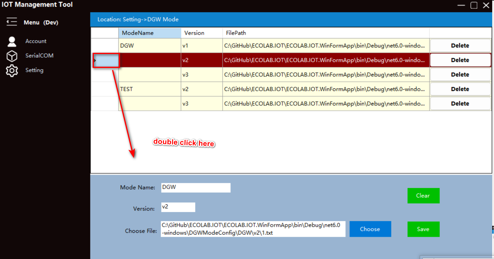

# Ecolink_SNPSK_tool 
***
## Instructions  
> * Sign in
>>   1. Select a language.
>>      <image src="/img/language.png">
>>   2. Select the login environment.
>>      <image src="/img/env.png">
>>   3. Select the login method, and select either of the two methods.
>>>    - ECOLink One click login。
>>>>    1. Click "ECOLink One Click Login" button.
>>>>        <image src="/img/ecolinkOneClickLogin.png">
>>>>    2. Navigate to the browser automatically, enter your ecolab email in the browser as your login account, and then click Next to enter your password, and then enter Verify. After successful login, you can close the browser and automatically log in to the main form.
>>>>    
>>>    - Internal account login
>>>>    1. Click "Internal account login" button.
>>>>      
>>>>    2. Enter the user name and password, and click Login.
>>>>      
>>>>    3. Click the Back button to switch the login mode.
>>>>      

> * main interface
>> - Account
>>> + Sign out，Click the Sign out menu to exit the main interface and return to the login interface, where you can switch the login language, environment and account.
>>>  
>> - SerialCOM
>>> + Burn，Mainly used to write SN and PSK numbers, send file.
>>>> 1. Configure serial port parameters and select "Connection" to connect the port of the burning device.
>>>>  
>>>> 2. Select the correct transmission mode in the "SendSetting", enter the correct SN number or select the corresponding file.
>>>>>  - CommonSendPattern，Write SN and PSK to the device. See the following figure for specific rules.
>>>>>    Note:
>>>>>    Display rules for prefixes.
>>>>>   `1`. "EnableMappingPrefixs" checked
>>>>>       The prefix will take the first three letters, and then match the settings in "Application ID Management" to associate the target prefix.
>>>>>           For example, if you enter AAA121212123, the target prefix set in "Application ID Management" is SSS, and the source prefix is AAA. The prefix here will display SSS.
>>>>>   `2`. "EnableMappingPrefixs" unchecked
>>>>>      ` `  2.1 If the first three characters entered are DMC or CON, the prefix will display DMC. 
>>>>>      ` `   For example：DMC121212123 or CON121212123，the prefix will display DMC。
>>>>>      ` `  2.2 If the first three characters entered are not DMC or CON, it displays the first three characters of the input box.
>>>>>      ` `    For example: SHG121211223, The prefix is SHG, as shown in the figure.
>>>>>        `    `
>>>>>  "EnableValidateSN" checked，The SN number entered will be verified. If it is not selected, the SN number entered will be verified.
>>>>>      ` `  The rule is: the length is 12, the first three characters must be letters, 4-5 represents the year, 6-7 represents the month, 8-9 represents the day, and 10-12 represents three random numbers.
>>>>>    
>>>>>  - FileSendPattern，Send the NVRAM configuration file of Dragon Gateway to the gateway.
>>>>>    Field Description:
>>>>>    `Transprot:`   It is divided into XModem1k and XModem (currently, the maximum file upload size is 1M. XModem1k is relatively fast, sending 1024 bytes at a time, and XModem is relatively slow, sending 128 bytes at a time).
>>>>>    `CRC:` ` ` ` ` ` ` The verification rules used in the transmission. If it is selected, CRC inspection is enabled. Otherwise, the default verification rules are used.
>>>>>    `Mode Name:` The type of mode to send.
>>>>>    `Version:` ` ` The version number in the corresponding mode.
>>>>>    
>>>> 3. Click the "BurnDown" button and wait for the return result. The success and failure results will be displayed in the acceptance area.
>>>>   
>>>>   
>> - Setting
>>> + Environment (The configuration of the generation environment can only be operated by super user)
>>>    Parameter Description：
>>>>      Name: Environment name, self defined, please use English，such as test,product.
>>>>      ClientID: ClientId corresponding to Keyvalut, viewed in AZURE cloud.
>>>>      ClientSecret: Keyvalut corresponding to ClientSecret, viewed in AZURE cloud.
>>>>      TenantId: Keyvalut corresponding to ClientSecret, viewed in AZURE cloud.
>>>>      KeyVaultUrl: Keyvalut corresponding to ClientSecret, viewed in AZURE cloud.
>>>>      PlatformName: PlatfromName corresponding to the registered device. 
>>>>      DeviceRegisterUrl: URL of the device (Concierge service, internal API)
>>>  
>>>> * Add, enter the corresponding value in the lower input box, and select Save.
>>>> 
>>>> * Delete. In the table, click Delete.
>>>> 
>>>> * Modify. Double click the mouse at the head of the form, and the corresponding value will be displayed in the lower input box. Then modify the corresponding value and click Save.
>>>> 
>>> + Application ID management. This page is used to generate the specified AppID as the device number prefix for the SN prefix. Please refer to the "Main Interface ->Serial Port ->Burning ->2 ->General Sending Mode" section. The corresponding picture contains specific rules.
>>>> * Add, enter the corresponding target prefix and source prefix on the left, and click Save. (The + or - at the back of the input box can be used to add or delete a new input box for the source prefix, and up to 8 target prefixes can be added.)
>>>>  
>>>> * Delete. In the table, click Delete.
>>>> 
>>>> * Modify. Double click the mouse at the head of the form, and the corresponding value will be displayed in the left input box. Then modify the corresponding value and click Save.
>>>> 
>>>> * Enabled. In the burning interface, select Send in Normal Mode and Enable Mapping Prefix.
>>>> 
>>> + AAD, If you use "ECOLink One Click Login", you need to configure the AAD link (the AAD link has an expiration time, which can only be viewed by ordinary users and modified by super administrators).
>>> 
>>> + DGW mode, send file type configuration. If you want to send a file, you can configure it here. Then navigate to the Serial Port=>Burning menu, select File Send, and then select the corresponding mode and version to send to the device.
>>>> Parameter Description:
>>>>> `Mode Name:` ` `Customized, which generally represents the type of device used.
>>>>> `Version:` ` ` ` ` Custom, version number
>>>>> `Choose File:` The file to be burned on the device.
>>>> * Add, enter the corresponding value in the lower input box, and select Save.
>>>> 
>>>> * Delete. In the table, click Delete.
>>>> 
>>>> * Modify. Double click the mouse at the head of the form, and the corresponding value will be displayed in the lower input box. Then modify the corresponding value and click Save.
>>>> 
>> - Help
>>> + Instruction
>>>   
>>> + Troubleshooting
>>>  

## High order operation
>> Logging enabled
>>> 1. o enable the log file function, modify the enable in the configuration file logsetting, and a log will be output to the track.txt file.
>>>    enable: true enable
>>>    enable: false disable
>>>>  `1.1 Configuration file 'logsetting'`
>>>>   
>>>>  `1.2 logsetting and track.txt path`
>>>>   
>>> 2. Receiving area under SerialCOM=>Burn menu, modify the deviceLogContinuity in the configuration file logsetting to modify the output mode。
>>>    deviceLogContinuity: true  The log will be continuously output to the receiving area.
>>>    deviceLogContinuity: false The current operation outputs the log to the receiving area.
>>>>  `2.1 config file 'logsetting'`
>>>>   
>>>>  `2.2 Receiving area under SerialCOM=>Burn menu`
>>>>   