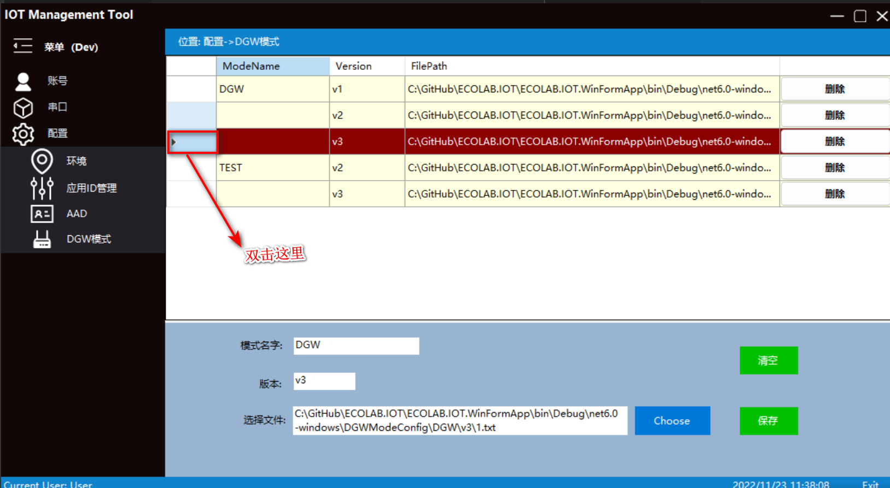

# Ecolink_SNPSK_tool 
***
## 使用说明  
> * 登录
>>   1. 选择语言。
>>      <image src="/img/language.png">
>>   2. 选择登录环境。
>>      <image src="/img/env.png">
>>   3. 选择登录方式，两种方式任意选择其中的一种。
>>>    - ECOLink 一键登录。
>>>>    1. 单击ECOLink一键登录按钮。
>>>>        <image src="/img/ecolinkOneClickLogin.png">
>>>>    2. 自动导航到浏览器，在浏览器中输入自己艺康邮箱作为登录账号，然后点击下一步输入密码，然后再输入验证码。登录成功后，可以关闭浏览器，会自动登录到主窗体。
>>>>    
>>>    - 内部账号登录
>>>>    1. 单击内部账号登录。
>>>>      
>>>>    2. 输入用户名和密码，点击登录。
>>>>      
>>>>    3. 点击返回按钮，切换登录方式。
>>>>      

> * 主界面
>> - 账号
>>> + 注销，点击注销菜单，会退出主界面，返回登录界面，可以切换登录的语言，环境和账号。
>>>  
>> - 串口
>>> + 烧制，主要用来写SN和PSK号。
>>>> 1. 配置串口参数，选择“链接”连接烧写设备端口.
>>>>  
>>>> 2. 在发送设置选择正确的发送模式，输入正确的SN号或选择对应的文件。
>>>>>  - SN_PSK发送，写SN和PSK到设备上，具体规则看下图。
>>>>>    Note:
>>>>>    前缀的显示规则。
>>>>>   `1`. "启用映射前缀" 选中
>>>>>       前缀会取前三个字母，然后去匹配"应用ID管理"里的设置，关联出目标前缀。
>>>>>           例如，输入AAA121212123, "应用ID管理"里边设置的目标前缀为SSS, 源前缀为AAA，这里的前缀会显示SSS。
>>>>>   `2`. "启用映射前缀" 没有选中
>>>>>      ` `  2.1 如果输入前三个字符是DMC或者CON ，前缀会显示DMC。 
>>>>>      ` `    例如：DMC121212123 或CON121212123，前缀显示DMC。
>>>>>      ` `  2.2 如果输入前三个字符不是DMC或者CON ，它显示输入框的前三个字符。
>>>>>      ` `    例如: SHG121211223, 前缀是SHG如图所示。
>>>>>        `    `
>>>>>  "启用验证SN"选中时，会对输入的SN号码进行验证。如果没有选中，则输入的SN号进行验证。
>>>>>      ` `  规则为:长度为12，前三个字符必须为字母，4-5表示年份，6-7表示月份，8-9表示天，10-12为三位随机数"
>>>>>    
>>>>>  - 文件发送，发送Dragon Gateway的NVRAM配置文件到gateway上。
>>>>>    字段说明:
>>>>>    `输协议:`   分为XModem1k, XModem (目前最大支持1M大小的文件上传，XModem1k 传输相对比较快,一次发送1024 byte，XModem比较慢，一次发送128 byte)。
>>>>>    `CRC:` ` ` ` ` ` ` 传输中使用的校验规则。如果选中则启用CRC检验，否者使用默认的校验规则。
>>>>>    `Mode Name:` 发送的模式类型。
>>>>>    `Version:` ` ` 对应模式下的版本号。
>>>>>    
>>>> 3. 点击烧制按钮，等待返回结果，在接受区会显示成功和失败的结果。
>>>>   
>>>>   
>> - 配置
>>> + 环境（生成环境的配置，只有超级管理，才能操作）
>>>    参数说明：
>>>>      Name: 环境名字，自己定义，请使用英文，例如test,product.
>>>>      ClientID: Keyvalut对应的ClientId,AZURE云里查看。
>>>>      ClientSecret: Keyvalut对应的ClientSecret,AZURE云里查看。
>>>>      TenantId: Keyvalut对应的ClientSecret,AZURE云里查看。
>>>>      KeyVaultUrl: Keyvalut对应的ClientSecret,AZURE云里查看。
>>>>      PlatformName: 注册设备对应的PlatfromName. 
>>>>      DeviceRegisterUrl: 设备的URL（Concierge服务，内部的API）
>>>  
>>>> * 添加，在下边输入框输入对应的值，选择保存。
>>>> 
>>>> * 删除，在表格的里，点击删除按钮。
>>>> 
>>>> * 修改，在表格头部，双击鼠标，对应的值会显示在下边的输入框，然后修改对应的值，点击保存即可。
>>>> 
>>> + 应用ID管理.这个页面的作用，为SN的前缀生成指定的AppID做设备号前缀，请参考：“主界面->串口->烧制->2->普通发送模式”章节，对应的图片里有具体的规则。
>>>> * 添加，在左边对应的输入对应的目标前缀和源前缀，点击保存。（源前缀可以输入框后边的+或-来添加删除新的输入框，目标前缀最多添加8个。）
>>>>  
>>>> * 删除，在表格的里，点击删除按钮。
>>>> 
>>>> * 修改，在表格头部，双击鼠标，对应的值会显示在左边的输入框，然后修改对应的值，点击保存即可
>>>> 
>>>> * 启用。在烧制界面的，选择普通模式发送，选择启用映射前缀。
>>>> 
>>> + AAD, 如果使用ECOLink 一键登录,需要配置AAD链接（AAD链接有过期时间，普通用户只可以查看，超级管理员才可以修改）。
>>> 
>>> + DGW模式, 发送文件类型配置。如果要发送文件，可以在这里配置。然后可以导航到串口=>烧制 菜单，选中文件发送，就可以选择对应的模式和版本发送到设备上。
>>>> 参数说明:
>>>>> `模式名字:` ` `自定义，一般代表那种设备上使用
>>>>> `版本:`     ` ` ` ` ` `自定义，版本号
>>>>> `选择文件:` ` `要烧制到设备上的文件
>>>> * 添加，在下边输入框输入对应的值，选择保存。
>>>> 
>>>> * 删除，在表格的里，点击删除按钮。
>>>> 
>>>> * 修改，在表格头部，双击鼠标，对应的值会显示在下边的输入框，然后修改对应的值，点击保存即可。
>>>> 
>> - 帮助
>>> + 使用说明
>>>   
>>> + 故障排查
>>>  

## 高阶操作
>> 日志功能启用
>>> 1. 日志文件功能的启用, 修改配置文件logsetting中的enable, 会有日志输出到track.txt文件中。
>>>    enable: true 启用
>>>    enable: false 停用
>>>>  `1.1 配置文件logsetting`
>>>>   
>>>>  `1.2 logsetting 和 track.txt 的路径`
>>>>   
>>> 2. 串口=>烧制 菜单下的接收区。修改配置文件logsetting中的deviceLogContinuity,可以修改输出方式。
>>>    deviceLogContinuity: true 会连续输出日志到接受区
>>>    deviceLogContinuity: false 当前操作输出日志到接受区
>>>>  `2.1 配置文件logsetting`
>>>>   
>>>>  `2.2 串口=>烧制 下的接收区`
>>>>   